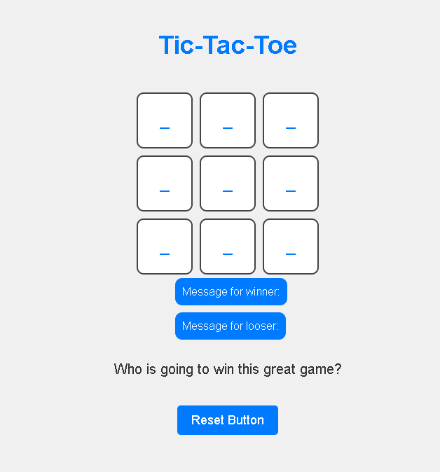
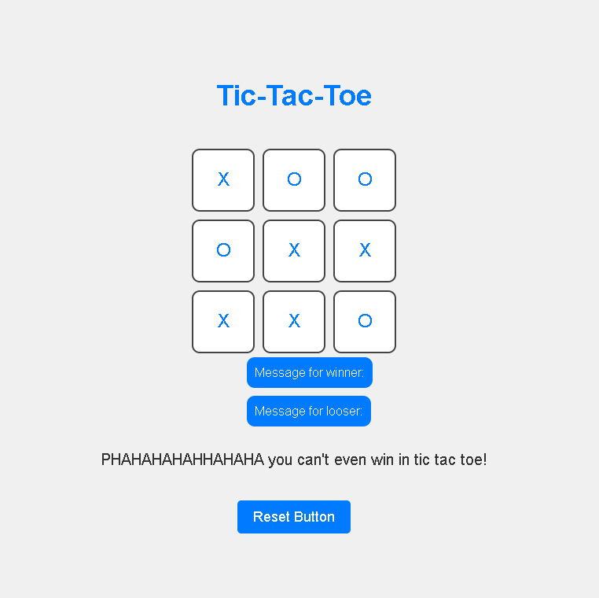
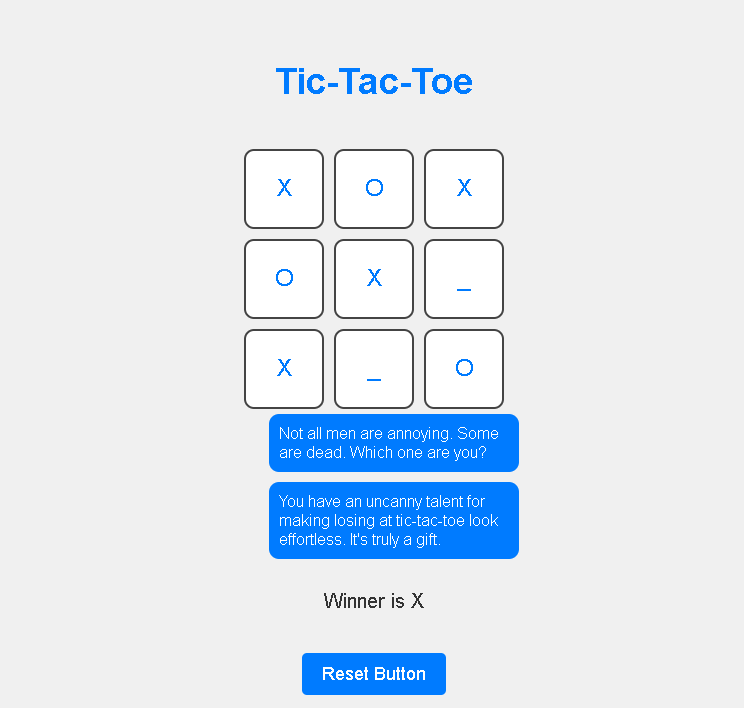

# Tic Tac Toe Game

## Description

Welcome to Tic Tac Toe! This is a classic game where you can challenge your friend and see who will emerge victorious in this epic battle of X's and O's.

**Important Note:** This game features some sarcastic jokes for winners and losers. If you have a good sense of humor and don't mind some playful banter, you'll have a great time playing!

## Gameplay

The game board consists of a 3x3 grid, and each cell can be filled with an "X" or an "O." Players take turns, and the objective is to be the first to complete a row, column, or diagonal with their symbol.

## Screenshots

Here are a couple of screenshots from the game:

## How to Play

1. Click on any empty cell on the game board to place your symbol ("X" or "O").
2. Players take turns until one of them wins or the board is full.
3. If any player completes a row, column, or diagonal with their symbol, they win!
4. If all cells are filled without a winner, the game ends in a draw.

[Play Tic Tac Toe](https://64c2c4f8d4dc35006bfc631b--delicate-kangaroo-73407f.netlify.app/)

## Winning and Losing Messages

The game has some amusing and sarcastic messages for the winners and losers. Don't take them seriously; they are all in good fun!

## Reset Button

You can reset the game at any time by clicking the "Reset Button." This will clear the board and start a new game.

## Ready to Play?

Go ahead and challenge your friend or play against yourself! May the best player win, or maybe not—either way, you're in for some entertaining moments.

Enjoy the game! 😄

---

**Developer's Note:** This project was a solo endeavor as part of my learning journey in JavaScript. If you have any feedback or suggestions for improvements, feel free to reach out. Happy gaming!
